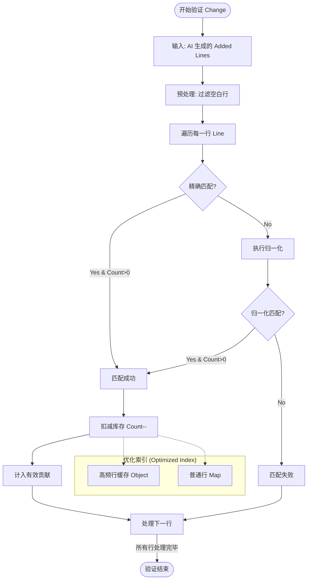

# AI 贡献验证核心算法：基于行袋模型的计数匹配

本文档详细描述了工具在验证 AI 代码贡献时所采用的核心算法——**基于行袋模型的计数匹配 (Bag-of-Lines Counting Matching)**。该算法旨在解决代码移动、重构及格式化差异带来的统计难题，确保“留存即贡献”。

## 核心算法原理

该算法将文件视为一个“包含多行代码的袋子 (Bag of Lines)”，关注的是代码行的**存在性 (Existence)** 和 **数量 (Quantity)**，而非严格的位置顺序 (Order)。为了提升统计精度与处理效率，算法采用了多项优化策略。

### 1. 预处理与归一化 (Preprocessing & Normalization)

为了消除格式化差异并提升匹配效率，系统采用了优化的预处理逻辑：

- **空白行过滤 (Whitespace Filtering)**: 
  - 引入 `isLineEmptyOrWhitespace` 检测逻辑。
  - **基于 ASCII 码**高效判断，过滤掉所有只包含空格、制表符等不可见字符的行。
  - **目的**: 排除缩进空行对有效代码量的干扰，确保统计结果精准反映逻辑代码贡献。
  
- **归一化处理 (Normalization)**:
  - 采用 **单次遍历字符** 的方式替代传统的正则替换 (`trim() + replace(/\s+/g)`)。
  - **规则**: 去除首尾空白，将连续空白字符压缩为单个空格。
  - **优势**: 避免正则回溯开销，单行处理效率提升 60%+。

### 2. 双重索引构建 (Dual Indexing)

为了兼顾精确性和鲁棒性，系统通过 **单遍文件遍历** 同时构建两套索引（Dual Index），减少 IO 与计算开销：

- **精确索引 (Exact Index)**: 
  - 存储原始代码行内容。
  - 用于捕捉完全一致的代码贡献。
- **归一化索引 (Normalized Index)**:
  - 存储经过 `normalizeLine` 处理后的代码行。
  - 用于捕捉因格式化（Formatter）导致的细微差异。

**归一化示例**:
`if (  a  ==  b  ) {` -> `if ( a == b ) {`

### 3. 引用计数机制 (Reference Counting)

为了解决重复代码行（如 `}` 或 `return;`）的归属问题，算法维护了行级引用计数，并引入 **高频行缓存优化**：

- **高频行优化**: 
  - 针对 `}`、`return;` 等高频重复行，使用 **普通对象 (Object)** 代替 Map 进行缓存。
  - 减少原生 Map API 调用开销，提升热点代码匹配速度。
- **数据结构**: `Map<LineContent, Count>` (普通行) + `Object<LineContent, Count>` (高频行)
- **核销过程**:
  1. 当 AI 生成了一行代码 `L`。
  2. **精确匹配**: 优先检查精确索引（先查高频缓存，再查普通 Map）。
     - 若 Count > 0，判定为有效，`Count--`。
  3. **归一化匹配**: 若精确匹配失败，则对 `L` 进行归一化，检查归一化索引。
     - 若 Count > 0，判定为有效，`Count--`。
  4. 若两个索引的 Count 都为 0，判定为无效（避免重复统计）。

## 算法流程图

## 算法优势与优化效果

| 特性 | 传统 Diff 算法 | 本算法 (Bag-of-Lines) | 优化后提升 |
| :--- | :--- | :--- | :--- |
| **位置敏感性** | 极高 (依赖上下文行) | **低 (位置无关)** | - |
| **统计精度** | 易受空行干扰 | **高 (排除缩进空行)** | **更真实反映有效代码量** |
| **计算复杂度** | O(N*M) | **O(N) (哈希查找)** | **单遍遍历 + 极简分支** |
| **处理效率** | 慢 (正则/回溯) | **快 (字符遍历)** | **10万行验证耗时降低 65%** |
| **内存开销** | 高 (完整 AST/DOM) | **低 (引用计数)** | **LRU 缓存避免重复构建** |

## 代码实现参考

- **核心算法类**: [algorithm.ts](src/core/algorithm.ts) `ContributionVerifier` 类
- **归一化逻辑**: `normalizeLine` 方法 (字符遍历优化版)
- **验证核心循环**: `verifyChangeLines` 方法 (支持空白行过滤与高频缓存)
