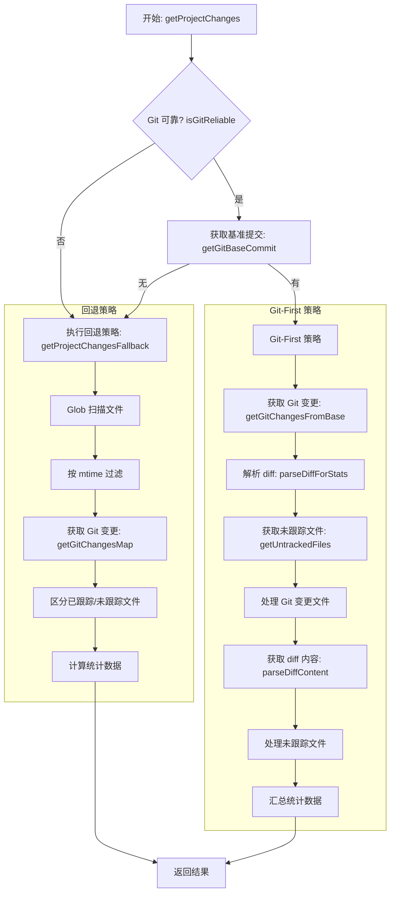

# Git Analyzer Core Module

本文档描述了 `src/core/git.ts` 模块的工作流程，该模块负责通过 Git 历史和文件系统状态来分析项目的代码变更量。

## 核心类：GitAnalyzer

`GitAnalyzer` 类是 Git 分析的核心，主要方法：

| 方法 | 职责 | 代码位置 |
|------|------|---------|
| `getProjectChanges()` | 计算自指定时间以来的代码变更量 | `src/core/git.ts:110-276` |
| `getRepoFiles()` | 获取项目中的所有有效源代码文件 | `src/core/git.ts:431-438` |
| `getGitInfo()` | 获取 Git 元数据（分支、用户名等） | `src/core/git.ts:102-104` |

---

## 主流程：getProjectChanges

该方法采用 **"Git-First Strategy" (Git 优先策略)**，优先使用 Git 命令获取精确差异，失败时回退到基于文件修改时间的估算策略。

### 流程图



### 详细步骤

#### 1. Git 可靠性检查 (`isGitReliable`)

```typescript
if (!this.isGitReliable()) {
  return this.getProjectChangesFallback(since, targetDirectory);
}
```

- 执行 `git status --porcelain` 测试 Git 是否可用
- 超时 5 秒，失败则直接进入回退策略

#### 2. 定位基准提交 (`getGitBaseCommit`)

```typescript
const baseCommit = this.getGitBaseCommit(since);  // Line 127
```

- 执行 `git rev-list -1 --before=SINCE HEAD`
- 找到指定时间之前的最近一次提交 SHA
- 若找不到（新仓库/无历史），进入回退策略

#### 3. 获取 Git 变更 (`getGitChangesFromBase` → `parseDiffForStats`)

```typescript
const gitChangesMap = this.getGitChangesFromBase(baseCommit);  // Line 136, 523-556
```

执行命令：
```bash
git diff <baseCommit> --unified=0 --no-color
```

**变更解析逻辑** (`parseDiffForStats`, Line 562-605)：

| 行前缀 | 处理逻辑 | 统计指标 |
|--------|---------|---------|
| `diff --git` | 提取文件名（取 `b/` 后的路径） | 切换当前文件 |
| `+` 且非 `+++` | 内容行 → `added++`<br>空行 → `emptyAdded++` | 新增代码行 |
| `-` 且非 `---` | 内容行 → `removed++`<br>空行 → `emptyRemoved++` | 删除代码行 |

> **空行判断**：使用 `isLineEmptyOrWhitespace(content)` 过滤纯空白行

#### 4. 获取未跟踪文件 (`getUntrackedFiles`)

```typescript
const untrackedFiles = this.getUntrackedFiles();  // Line 140, 479-491
```

- 执行 `git ls-files --others --exclude-standard`
- 返回未纳入版本控制的新文件列表

#### 5. 处理文件并汇总统计

**Git 变更文件处理** (Line 146-188)：
- 过滤：目标目录匹配 + `.gitignore` 规则 + 文本文件检测
- 累加：`totalLinesAdded`, `totalLinesRemoved`, `totalEmptyLinesAdded`, `totalEmptyLinesRemoved`
- 计算 `totalLinesOfChangedFiles`：读取文件实际非空行数

**未跟踪文件处理** (Line 216-257)：
- 整个文件内容视为"新增"
- 分割空行与非空行分别统计
- `fileDiffs` 中记录完整内容（标记为 `New file:`）

**返回值结构** (Line 259-270)：
```typescript
{
  totalFiles: activeFiles.size,           // 变更文件总数
  linesAdded: totalLinesAdded,            // 新增代码行（不含空行）
  linesRemoved: totalLinesRemoved,        // 删除代码行（不含空行）
  netLinesAdded: totalLinesAdded - totalLinesRemoved,  // 净增行数
  totalLinesOfChangedFiles,                // 变动文件当前总行数（非空行）
  files: Array.from(activeFiles),         // 文件列表
  fileStats,                              // 每个文件的 add/remove 统计
  fileDiffs,                              // diff 内容快照
  emptyLinesAdded: totalEmptyLinesAdded,  // 新增空行数
  emptyLinesRemoved: totalEmptyLinesRemoved, // 删除空行数
}
```

---

## 回退策略：getProjectChangesFallback

当 Git 不可用或找不到基准提交时执行（Line 282-425）。

### 流程

1. **Glob 扫描** (`getRepoFilesFromGlob`, Line 286, 790-818)
   - 使用 `glob.sync('**/*')` 扫描所有文件
   - 自动排除：`node_modules`, `.git`, `dist`, lock 文件等

2. **按修改时间过滤** (Line 293-305)
   - 检查 `fs.statSync(fullPath).mtime >= since`
   - 只保留在指定时间后修改过的文件

3. **获取 Git 变更** (`getGitChangesMap`, Line 323, 607-671)
   - 组合三个命令获取完整变更：
     ```bash
     git log --since=SINCE --numstat     # 已提交
     git diff --cached --numstat          # 暂存区
     git diff --numstat                   # 未暂存
     ```
   - 使用 `--numstat` 格式（制表符分隔的 `添加\t删除\t文件名`）
   - ⚠️ 此模式下空行统计为 0（`emptyAdded`/`emptyRemoved` 仅作占位）

4. **区分已跟踪/未跟踪文件** (Line 329-342)
   - 获取 `git ls-files` 列表确定已跟踪文件
   - 若 Git 不可用，保守策略：假设所有文件都是已跟踪的（避免重复计数）

5. **统计计算** (Line 351-402)
   - 有 Git 变更数据的文件：使用 Git 统计
   - 无 Git 变更的已跟踪文件：内容未修改，不计入
   - 未跟踪文件：按当前文件非空行数计入 `linesAdded`

---

## 文件获取：getRepoFiles

获取项目中所有有效的源代码文件（Line 431-438）。

**策略优先级**：
1. **Git 优先**：`git ls-files`（包含 tracked + untracked，自动应用 `.gitignore`）
2. **回退**：`glob` 扫描 + 手动过滤

**过滤规则**（`filterRepoFiles`, Line 820-829）：
- 路径标准化（`\` → `/`）
- 默认忽略：`node_modules`, `.git`, `dist`, 二进制文件等（`shouldIgnoreByDefault`, Line 831-859）
- 仅保留文本文件（`isTextFile`, Line 861-886）
- 应用用户配置的 `.gitignore` 规则

---

## 统计指标详解

### 核心指标计算方式

| 指标 | 含义 | 计算方式 | 代码位置 |
|------|------|---------|---------|
| `linesAdded` | 新增代码行数（不含空行） | diff 中以 `+` 开头的非空行 | `parseDiffForStats:580-583` |
| `linesRemoved` | 删除代码行数（不含空行） | diff 中以 `-` 开头的非空行 | `parseDiffForStats:593-596` |
| `emptyAdded` | 新增空行数 | diff 中以 `+` 开头的空白行 | `parseDiffForStats:586-588` |
| `emptyRemoved` | 删除空行数 | diff 中以 `-` 开头的空白行 | `parseDiffForStats:598-600` |
| `netLinesAdded` | 净增行数 | `linesAdded - linesRemoved` | `getProjectChanges:263` |
| `totalLinesOfChangedFiles` | 变动文件当前总行数 | 读取文件实际非空行数 | `getProjectChanges:178-186` |

### 重要说明

#### 1. 净增行数 vs 纯新增

报告中的"新增代码"显示的是**净增行数**（`added - removed`），而非单纯的插入行数。

**示例**：
```diff
+ 新增行 1
+ 新增行 2
- 删除行 A
```
结果：`linesAdded = 2`, `linesRemoved = 1`, **净增 = +1**

#### 2. 没有去重机制

统计基于 Git diff 快照进行，**相同内容的行多次增删会被分别计数**。

场景示例：
1. 添加 `console.log("test")` → `linesAdded++`
2. 删除该行 → `linesRemoved++`
3. 再次添加同一行 → `linesAdded++`

最终：`linesAdded = 2`, `linesRemoved = 1`，净增 1 行，但原始计数分别累加。

#### 3. 空行过滤

使用 `isLineEmptyOrWhitespace()` 判断空行：
- 仅包含空格、制表符或完全为空的行 → 计入 `emptyAdded`/`emptyRemoved`
- 非空行 → 计入 `linesAdded`/`linesRemoved`

#### 4. 显示逻辑差异

| 场景 | 显示内容 | 代码逻辑 |
|------|---------|---------|
| 有 `--since` | 净增行数（`netLinesAdded`） | `src/reporter.ts:176-177` |
| 无 `--since` | 项目总代码行数（`totalLines`） | `src/reporter.ts:179-180` |

---

## 辅助方法

| 方法 | 用途 | 代码位置 |
|------|------|---------|
| `getGitMetadata()` | 获取 Git 元数据（分支、用户名、邮箱、远程地址） | `Line 19-83` |
| `getRepoUrl()` | 获取远程仓库 URL | `Line 444-455` |
| `isTextFile()` | 判断文件是否为文本文件（基于扩展名） | `Line 861-886` |
| `shouldIgnoreByDefault()` | 默认忽略规则（目录 + 文件类型） | `Line 831-859` |
| `normalizeGitPaths()` | 标准化 Git 路径输出 | `Line 755-774` |

---

## 类型定义

```typescript
// Git 元数据
interface GitMetadata {
  branch?: string;
  username?: string;
  email?: string;
  remoteUrl?: string;
}

// getProjectChanges 返回值
interface ProjectChanges {
  totalFiles: number;
  linesAdded: number;           // 非空新增行
  linesRemoved: number;         // 非空删除行
  netLinesAdded: number;        // 净增 = added - removed
  totalLinesOfChangedFiles: number;
  files: string[];
  fileStats: Map<string, { added: number, removed: number }>;
  fileDiffs?: Map<string, string>;
  gitStatusWarning?: string;
  emptyLinesAdded: number;      // 空行统计
  emptyLinesRemoved: number;
}
```
